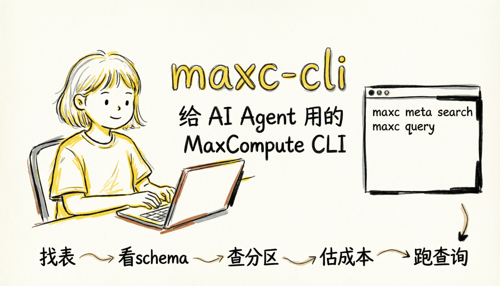
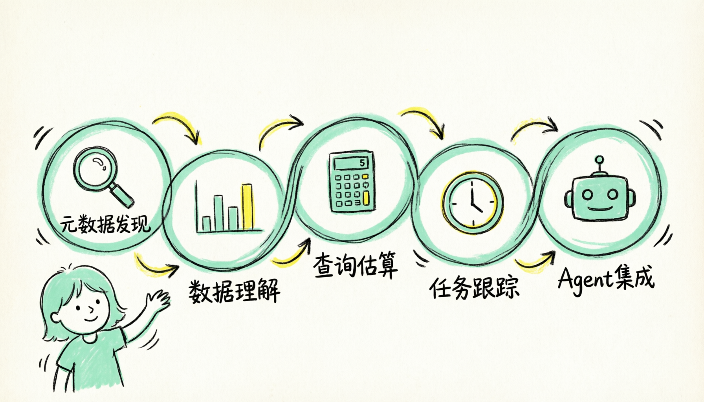

# maxc-cli：让 MaxCompute 真正进入 AI / Agent 工作流

> 一套面向 AI Agent 的 MaxCompute CLI 工具层：结构化输出、默认安全、可恢复、可积累上下文；这次同时发布配套 **SKILL**，让 Agent 能稳定完成数据任务闭环。

> 2026-08 更新：公共云首选 Alibaba Cloud CLI 3.3.3+ 的
> `aliyun maxc` 入口与 OAuth；Skill 名为 `alibabacloud-maxcompute-cli`。
> 本文中的历史命令输出截图可能来自独立 `maxc` 入口。

`odpscmd` 面向终端人工操作，`pyodps` 面向 Python 程序集成，`maxc-cli` 面向以下 Agent 场景：

> **AI Agent 如何把 MaxCompute 变成自己可以稳定编排、持续调用、安全执行的外部能力。**

`maxc-cli` 是 MaxCompute 面向 Agent 工作流的一层统一命令面。本次还发布了一份可直接被 Agent 平台消费的 **SKILL**：它定义了何时调用 CLI、如何完成认证、元数据发现、查询、结果续取以及 semantic metadata 工作流，让 Claude Code、OpenAI-compatible agent、IDE Agent 等上层系统可以按统一契约使用 MaxCompute。



---

## 为什么 MaxCompute 在 AI 时代需要新的 CLI

过去，MaxCompute 的工具体系天然偏向人类使用：命令行给人看、SDK 给脚本用、控制台负责交互、出错靠人兜底。这套体系在“人是主操作者”的时代完全成立。

但在 AI / Agent 工作流里，真实路径已经变成：

> 用户提出问题 → Agent 理解意图 → Agent 调用工具 → Agent 组合结果 → Agent 继续执行下一步

这时，关键问题变成：

> **有没有一层稳定、结构化、可约束、低歧义的接口，让 Agent 能把一次数据任务真正闭环跑完。**

一个看似普通的请求——“先找表、看结构、确认成本，再跑结果”——对人类工程师不难，但对 Agent 来说，缺少统一工具时，任务会被拆成很多割裂步骤：搜表、看 schema、查分区、估成本、提交 SQL、分页取结果、补查错误上下文、保存本轮理解。这些步骤散落在控制台、文档、脚本、SDK 和错误信息之间，导致 Agent 反复试探、补调用和重新理解数据。

`maxc-cli` 要做的，就是把这条原本分散的链路接成一套 Agent 可直接调用的统一接口：入口统一、输出统一、错误统一、上下文可复用、后续动作可提示，并且与配套 Skill 一起交付。

---

## 按效果说话：同一件事，传统方式怎么做，maxc-cli 怎么做

下面直接展示当前版本 `maxc-cli` 的结构化输出、agent hints 和安全护栏。

### 1）找表之后，Agent 知道下一步该做什么

传统方式里，Agent 即使搜到了表，后面是看 schema、抽样，还是直接写 SQL，仍然要自己判断。

`maxc-cli` 里，搜索结果会把“命中结果”和“下一步建议”一起返回。

```bash
python3 -m maxc_cli meta search schools --json
```

返回片段如下：

```json
{
  "command": "meta search",
  "status": "success",
  "data": {
    "search": {
      "keyword": "schools",
      "matches": [
        {
          "table_name": "schools",
          "score": 5
        }
      ]
    }
  },
  "agent_hints": {
    "next_actions": [
      "meta describe <table_name> --json",
      "data sample <table_name> --json"
    ]
  }
}
```

继续执行：

```bash
python3 -m maxc_cli meta describe california_schools.schools --json
```

实际返回里已经能直接拿到：
- `column_count: 49`
- `size_mb: 1.36`
- 完整 schema
- owner、created_at、updated_at

更重要的是：

> **Agent 找到表后，可以直接读取工具返回的后续动作。**

---

### 2）结构化错误携带下一步动作

传统方式里，命令失败后，Agent 通常只能拿到一段文本异常，再自己判断应该回头搜表、列举表，还是补查 schema。

`maxc-cli` 的错误返回已经是结构化的，而且会直接给出建议动作。

```bash
python3 -m maxc_cli data sample app.user_profile --rows 5 --json
```

返回片段如下：

```json
{
  "command": "data sample",
  "status": "failure",
  "error": {
    "code": "NOT_FOUND",
    "message": "... Schema app does not exist",
    "suggestion": "Run `maxc meta list-tables` or `maxc meta search` to verify the object exists."
  }
}
```

关键在于：

> **失败后，Agent 可以从结构化错误中判断下一步应搜索表或列出表。**

---

### 3）默认安全执行，生成后先校验

在 Agent 场景里，未经确认执行写操作会带来较高风险。

看一个真实命令：

```bash
python3 -m maxc_cli query "DELETE FROM t WHERE ds='20260415'" --json
```

当前环境里这条命令先失败在目标表不存在；但从实现层面看，`maxc-cli` 默认会以只读方式执行查询，并向服务端注入 `odps.sql.read.only=true`。只有显式带 `--force` 时，才允许越过只读护栏。

`maxc-cli` 的默认策略是：

> **先把写风险挡住，再给出显式升级入口。**

对人类工程师来说，直接执行是一种效率；对 Agent 来说，默认只读才是更稳妥的起点。

---

### 4）覆盖 SQL 全生命周期的可恢复任务

Agent 的完整任务包括执行 SQL、提交任务、等待完成、获取结果和必要时继续续跑。

这条链路已经打通。我们实际跑了一次：

```bash
python3 -m maxc_cli job submit "SELECT 1" --json
```

返回片段如下：

```json
{
  "command": "job submit",
  "status": "pending",
  "data": {
    "job_id": "20260419142738209gev534seihy"
  },
  "metadata": {
    "sql_executed": "SELECT 1"
  },
  "agent_hints": {
    "next_actions": [
      "job wait 20260419142738209gev534seihy --json",
      "job status 20260419142738209gev534seihy --json"
    ]
  }
}
```

继续执行：

```bash
python3 -m maxc_cli job wait 20260419142738209gev534seihy --json
```

实际返回中已经拿到了：
- `rows: [{"_c0": 1}]`
- `schema: [{"name": "_c0", "type": "INT"}]`
- `bytes_scanned: 4`
- `elapsed_ms: 3000`
- `task_cost_cpu: 5`

`maxc-cli` 把一条 SQL 纳入可观察、可恢复、可续跑的任务生命周期。

---

### 5）查询前先估成本和执行信息

传统方式里，SQL 要不要直接执行，更多依赖人类经验判断。对 Agent 来说，更理想的是工具先把成本和执行信息交出来。

现在已经支持：

```bash
python3 -m maxc_cli query cost "SELECT 1" --json
```

返回片段如下：

```json
{
  "command": "query cost",
  "status": "success",
  "data": {
    "analysis": {
      "operation": "SELECT",
      "normalized_sql": "SELECT 1",
      "estimated_input_size_bytes": 4,
      "sql_complexity": 1.0,
      "projected_columns": ["1"]
    }
  },
  "agent_hints": {
    "next_actions": [
      "query explain 'SELECT 1' --json",
      "query 'SELECT 1' --json"
    ]
  }
}
```

`query cost` 帮助 Agent 在执行前判断：
- 这是读操作还是写操作
- 大概会扫多少数据
- 下一步更适合 explain 还是直接 run

Agent 可以先判断，再执行。

---

### 6）沉淀数据理解，供后续会话复用

传统 CLI 很少考虑“数据理解如何沉淀”。但对 Agent 来说，如果每次都要重新猜一张表是干什么的、适合做什么，就会浪费很多上下文和调用次数。

现在已经支持把这类理解写回本地：

```bash
python3 -m maxc_cli meta semantic set app.user_profile \
  --desc '用户画像宽表，按 dt 分区，每日增量产出' \
  --use-case '用户分层分析' \
  --use-case '用户画像补全' \
  --json
```

返回片段如下：

```json
{
  "command": "meta semantic set",
  "status": "success",
  "data": {
    "action": "set_semantic",
    "table_name": "app.user_profile",
    "has_description": true
  },
  "agent_hints": {
    "next_actions": [
      "meta.describe app.user_profile --json"
    ]
  }
}
```

继续执行：

```bash
python3 -m maxc_cli meta semantic get app.user_profile --json
```

实际返回中已经能拿到本地持久化的 semantic 信息：
- `semantic_desc: 用户画像宽表，按 dt 分区，每日增量产出`
- `use_cases: ["用户画像补全"]`
- `generated_by: agent`

这类能力超出传统 CLI 的常见范围，但对 Agent 很重要。它带来的直接变化是：

> **再次访问同一张表时，Agent 可以复用已保存的语义信息。**

---

### 7）同时发布可被 Agent 平台消费的 Skill

本次发布包含与 `maxc-cli` 配套的 `SKILL.md`，供 Agent 平台读取调用规则。

仓库里的 Skill 已经明确写出：
- 何时应该使用 `aliyun maxc` 或独立 `maxc`
- 适用任务包括环境准备、认证、自定义 project/schema、元数据发现、只读 SQL、cache 与 semantic metadata workflow
- 公共云优先使用 `aliyun maxc ...`，独立 Python 入口要求 Python 3.9+
- 使用 `agent context`、`agent manifest`、`agent doctor --online` 分离本地检查、命令发现和在线验证
- 如何从 odpscmd 迁移已有工作方式

这意味着，上层 Agent 可以直接消费 `alibabacloud-maxcompute-cli` Skill 与
实时 manifest，把 MaxCompute CLI 接成标准能力，而不需要猜测命令参数。

因此，本次发布包括以下 Agent 调用能力：

- 一个面向 Agent 的 CLI
- 一份 agent-readable 的 Skill 定义
- 一套围绕 MaxCompute 的标准调用方式



---

## 小结

`odpscmd` 面向终端人工操作，`pyodps` 面向程序集成，`maxc-cli` 面向 Agent 场景：

> **让 Agent 按统一契约稳定调用 MaxCompute。**

它的价值在于把 MaxCompute 命令组织为 Agent 可持续编排的外部能力。

从这个角度看，本次 CLI 发布也是 MaxCompute 面向下一代工作流的一次接口升级。
