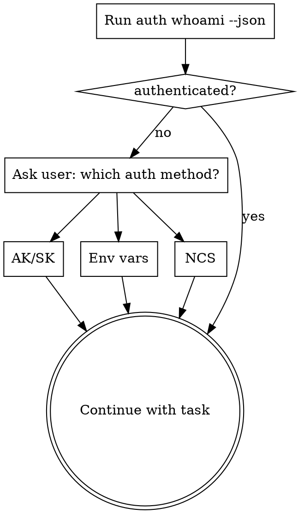

# Use MaxC CLI

Use the live CLI instead of inventing a separate MaxCompute adapter. Prefer `maxc ...`; fall back to `python3 -m maxc_cli ...` when the console script is not on `PATH`.

## When To Use

- First-time setup or repair of Python, `maxc-cli`, or `ncs`
- Auth bootstrap or identity inspection (any auth method)
- Session project or schema overrides
- Metadata discovery, schema inspection, cache-backed search
- Read-only query execution or job tracking
- Cache and semantic-metadata workflows

Do **not** use when the task is to implement `maxc-cli` itself, or when the user wants raw pyodps/SDK code.

## Bootstrap Flow

**When auth is not ready, always ask the user before choosing a path:**

> "Which auth method would you like to use?
> (A) Access Key / Secret Key — long-lived key pair
> (B) Environment variables — keys already set in the current shell
> (C) NCS — internal machine account (requires `ncs` CLI)"

Then follow the corresponding section in [references/bootstrap-auth.md](references/bootstrap-auth.md).

## First Pass

1. Prefer `maxc ...`; use `python3 -m maxc_cli ...` if not on `PATH`. If the machine may not be bootstrapped, read [references/setup-install.md](references/setup-install.md) first.
2. Run `maxc auth whoami --json`. Check `data.identity`:
   - `authenticated=true, validation_status=verified` → ready, continue.
   - `configured=false` → no auth set up → **ask which method** (see Bootstrap Flow above).
   - `configured=true, validation_status=failed` → config exists but remote check failed → inspect warnings, then fix or re-login.
3. Read [references/bootstrap-auth.md](references/bootstrap-auth.md) for all three auth paths.
4. Read [references/ncs-auth.md](references/ncs-auth.md) when using NCS.
5. If `meta list-tables --json` returns `cache_miss`, run `cache build --json` first.
6. Read [references/command-patterns.md](references/command-patterns.md) for command syntax and output shapes.

## Working Rules

- Stay read-only unless the user explicitly asks for state changes. Query execution limited to `SELECT`.
- Prefer `--json` for machine-driven work.
- `--json` stdout is one final envelope. Exception: `job wait --stream` emits NDJSON events.
- `cache build --json` emits progress to `stderr`, one final envelope to `stdout`.
- Trust runtime help and actual command output over stale snippets.
- Never install or upgrade Python without explicit user confirmation.
- Prefer `auth login` / `auth login-ncs` over hand-editing `~/.maxc/config.yaml`.
- `meta list-tables` is cache-backed; returns `cache_miss` on cold cache.
- `session set/show/unset` are local-only — no authenticated backend required.
- `agent context` is a fast local config summary; does not enumerate tables.
- Use normalized `data` shapes: `auth whoami` → `data.identity`, `query`/`job result` → `data.result`, `meta describe` → `data.table`, `data sample` → `data.sample`.
- Use `agent_hints.action_ids` for stable program logic; `next_actions` are hints only.

## Common Mistakes

| Mistake | Correct approach |
|---------|-----------------|
| Picking NCS without asking the user | Always ask which auth method before bootstrapping |
| Using `auth login --from-env` without checking env vars exist | Run `auth whoami --json` first; only use `--from-env` when env vars are confirmed set |
| Hand-editing `~/.maxc/config.yaml` | Use `auth login` or `auth login-ncs` |
| Persisting temporary keys from `ncs create credential` output | Save provider config with `auth login-ncs`; let runtime invoke `ncs` |
| Calling `meta list-tables` on a cold cache | Run `cache build --json` first |
| Inventing endpoints | Only use endpoints the user provided or that exist in current config |
| Using `job wait --stream` and expecting a JSON envelope | `--stream` emits NDJSON; use plain `job wait --json` for envelope |

## Command Families

- Bootstrap: `python3 --version`, `pip install maxc-cli`, `python3 -m maxc_cli --help`, `scripts/install_ncs.sh`
- Auth and session: `auth whoami`, `auth login`, `auth login-ncs`, `auth can-i`, `session set/show/unset`
- Metadata and data: `meta list-tables`, `meta describe`, `meta search`, `meta search-columns`, `meta latest-partition`, `meta freshness`, `meta partitions`, `meta list-projects`, `meta list-schemas`, `data sample`, `data profile`
- Query and jobs: `query`, `query cost`, `query explain`, `job submit/status/wait/result/diagnose/cancel/list`
- Cache and semantic metadata: `cache build`, `cache build-status`, `cache status`, `cache clear`, `cache save-semantic`, `cache get-semantic`, `meta semantic set/get/list-missing`
- Diffs and context: `diff schema`, `diff partition`, `diff data`, `agent context`
