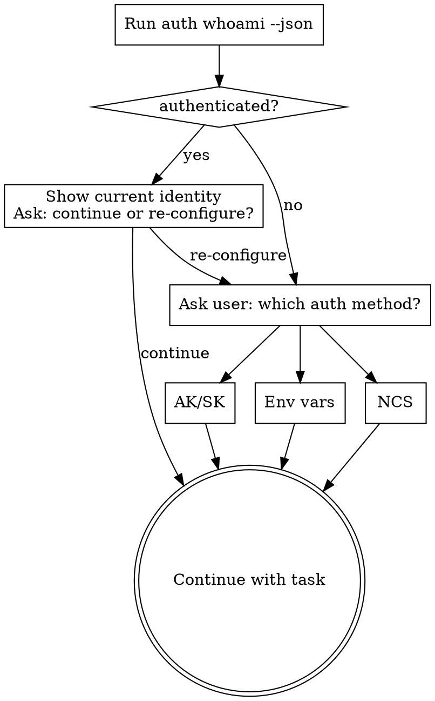

# Use MaxC CLI

Use the live CLI instead of inventing a separate MaxCompute adapter. Prefer `maxc ...`; fall back to `python3 -m maxc_cli ...` when the console script is not on `PATH`.

## When To Use

- First-time setup or repair of Python, `maxc-cli`, or `ncs`
- Auth bootstrap or identity inspection (any auth method)
- Session project or schema overrides
- Metadata discovery, schema inspection, cache-backed search
- Read-only query execution or job tracking
- Cache and semantic-metadata workflows

Do **not** use when the task is to implement `maxc-cli` itself, or when the user wants raw pyodps/SDK code.

## Bootstrap Flow



**When already authenticated, always show the current identity and ask before continuing:**

> "Currently authenticated as `<principal_display>` on project `<project>` via `<auth_type>`.
> Continue with this, or re-configure auth?"

**When auth is not ready, always ask the user before choosing a path:**

> "Which auth method would you like to use?
> (A) Access Key / Secret Key — long-lived key pair
> (B) Environment variables — keys already set in the current shell
> (C) NCS — internal machine account (requires `ncs` CLI)"

Then follow the corresponding section in [references/bootstrap-auth.md](references/bootstrap-auth.md).

## First Pass

1. Prefer `maxc ...`; use `python3 -m maxc_cli ...` if not on `PATH`. If the machine may not be bootstrapped, read [references/setup-install.md](references/setup-install.md) first.
2. Run `maxc auth whoami --json`. Check `data.identity`:
   - `authenticated=true, validation_status=verified` → ready, continue.
   - `configured=false` → no auth set up → **ask which method** (see Bootstrap Flow above).
   - `configured=true, validation_status=failed` → config exists but remote check failed → inspect warnings, then fix or re-login.
3. Read [references/bootstrap-auth.md](references/bootstrap-auth.md) for all three auth paths.
4. Read [references/ncs-auth.md](references/ncs-auth.md) when using NCS.
5. If `meta list-tables --json` returns `cache_miss`, run `cache build --json` first.
6. Read [references/command-patterns.md](references/command-patterns.md) for command syntax and output shapes.

## Working Rules

- Stay read-only unless the user explicitly asks for state changes. Query execution limited to `SELECT`.
- Prefer `--json` for machine-driven work.
- `--json` stdout is one final envelope. Exception: `job wait --stream` emits NDJSON events.
- `cache build --json` emits progress to `stderr`, one final envelope to `stdout`.
- Trust runtime help and actual command output over stale snippets.
- Never install or upgrade Python without explicit user confirmation.
- Prefer `auth login` / `auth login-ncs` over hand-editing `~/.maxc/config.yaml`.
- `meta list-tables` is cache-backed; returns `cache_miss` on cold cache.
- `session set/show/unset` are local-only — no authenticated backend required.
- `agent context` is a fast local config summary; does not enumerate tables.
- Use normalized `data` shapes: `auth whoami` → `data.identity`, `query`/`job result` → `data.result`, `meta describe` → `data.table`, `data sample` → `data.sample`.
- Use `agent_hints.action_ids` for stable program logic; `next_actions` are hints only.

## Common Mistakes

| Mistake | Correct approach |
|---------|-----------------|
| Picking NCS without asking the user | Always ask which auth method before bootstrapping |
| Using `auth login --from-env` without checking env vars exist | Run `auth whoami --json` first; only use `--from-env` when env vars are confirmed set |
| Hand-editing `~/.maxc/config.yaml` | Use `auth login` or `auth login-ncs` |
| Persisting temporary keys from `ncs create credential` output | Save provider config with `auth login-ncs`; let runtime invoke `ncs` |
| Calling `meta list-tables` on a cold cache | Run `cache build --json` first |
| Inventing endpoints | Only use endpoints the user provided or that exist in current config |
| Using `job wait --stream` and expecting a JSON envelope | `--stream` emits NDJSON; use plain `job wait --json` for envelope |
| Running a query without checking cost first | Use `query cost` before large queries; use `--cost-check` to set auto-abort threshold |
| Ignoring `agent_hints.warnings` in the response | Always check warnings — they surface backend issues, cache staleness, and cost alerts |
| Assuming `meta describe` data is live | Cache source may be stale; check `metadata.source` field and `agent_hints.warnings` |

## Error Recovery

When a command returns `status=failure`, inspect the `error.code` field to determine the recovery action:

| `error.code` | Meaning | Recovery |
|--------------|---------|----------|
| `VALIDATION_ERROR` | Invalid input or missing required args | Fix the arguments and retry |
| `NOT_FOUND` | Table, job, or resource does not exist | Check the name with `meta search` or `job list` |
| `PERMISSION_DENIED` | No access to the resource | Run `auth can-i --table <t> --operation SELECT --json` to verify; switch account if needed |
| `SQL_ERROR` | SQL syntax or execution error | Fix the SQL; use `query explain` to validate syntax first |
| `COST_LIMIT_EXCEEDED` | Query cost exceeds `--cost-check` threshold | Lower the scan scope (add partition filters, reduce columns), or raise the threshold |
| `BACKEND_CONNECTION_ERROR` | Network or service unavailable | Retry after a delay; check endpoint with `auth whoami --json` |
| `JOB_TIMEOUT` | Job did not complete within `--timeout` | Use `job status <id> --json` to check progress; `job wait <id> --timeout <longer>` to continue |
| `QUOTA_EXCEEDED` | Project quota limit reached | Wait and retry, or contact project admin |
| `EXECUTION_FAILED` | General backend failure | Run `job diagnose <id> --json` if a job_id is available |
| `FEATURE_UNAVAILABLE` | Feature not supported in current backend | Check `agent context --json` for supported operations |

Always check `error.suggestion` — it contains actionable next steps when available.

## Wait and Timeout Behavior

- `query "..." --wait N --json`: polls for up to N seconds. If the job finishes within N seconds, returns the result. If not, auto-promotes to async and returns `status=pending` with a `job_id`.
- `query "..." --wait 0 --json`: submits the job and returns immediately with `status=pending` and a `job_id`.
- `job wait <id> --timeout N --json`: waits up to N seconds for the job to complete. Returns `status=pending` if the timeout is reached.
- Default `--wait` for `query` is 10 seconds. Default `--timeout` for `job wait` is 300 seconds.
- For long-running queries, use `--wait 0` to get the job_id immediately, then poll with `job status`.

## Multi-Project Workflow

```bash
# List accessible projects
maxc meta list-projects --json

# Switch to a different project
maxc session set --project other_project --json

# Optionally set a specific schema
maxc session set --project other_project --schema my_schema --json

# Verify the switch
maxc session show --json

# Build cache for the new project
maxc cache build --json

# Revert to config defaults
maxc session unset --json
```

Session overrides are stored in `~/.maxc/session_override.yaml` and take priority over config files and env vars for project/schema only.

## Cost Control

Before running large queries, always estimate cost first:

```bash
# Check cost before executing
maxc query cost "SELECT * FROM big_table" --json

# Auto-abort if cost exceeds threshold (in CU)
maxc query "SELECT * FROM big_table" --cost-check 10.0 --json

# Use dry-run to see the plan without execution
maxc query "SELECT * FROM big_table" --dry-run --json
```

The `agent context` output includes `cost_threshold_cu` (project-level default) and `allowed_operations` — respect these guardrails.

## Semantic Metadata Workflow

Semantic metadata enriches tables with business context for NL2SQL and agent discovery.

```bash
# Check which tables need semantic metadata
maxc meta semantic list-missing --json

# Add semantic metadata (agent generates this from LLM understanding)
maxc meta semantic set my_table \
  --desc "Daily user login events" \
  --use-cases "login funnel analysis" "DAU calculation" \
  --sample-questions "How many users logged in yesterday?" \
  --column-semantics '[{"name":"user_id","semantic_type":"user_identifier"}]' \
  --json

# Retrieve existing metadata
maxc meta semantic get my_table --json

# Verify in describe output (semantic section appears when metadata exists)
maxc meta describe my_table --json
```

When `meta describe` returns a warning about missing semantic metadata, the agent should generate it using its own LLM understanding of the table schema and save it with `meta semantic set`.

## Diff Workflow

Use diff commands to compare tables across environments or track schema changes:

```bash
# Compare schemas of two tables
maxc diff schema table_a table_b --json

# Compare partition lists
maxc diff partition table_a table_b --json

# Compare data by key columns (read-only snapshot comparison)
maxc diff data table_a table_b --keys id --columns value_col --rows 100 --json

# Compare with different partitions on each side
maxc diff data prod_table staging_table \
  --keys user_id \
  --left-partition ds=2026-04-09 \
  --right-partition ds=2026-04-10 \
  --json
```

## Command Families

- Bootstrap: `python3 --version`, `pip install maxc-cli`, `python3 -m maxc_cli --help`, `scripts/install_ncs.sh`
- Auth and session: `auth whoami`, `auth login`, `auth login-ncs`, `auth can-i`, `session set/show/unset`
- Metadata and data: `meta list-tables`, `meta describe`, `meta search`, `meta search-columns`, `meta latest-partition`, `meta freshness`, `meta partitions`, `meta list-projects`, `meta list-schemas`, `data sample`, `data profile`
- Query and jobs: `query`, `query cost`, `query explain`, `job submit/status/wait/result/diagnose/cancel/list`
- Cache and semantic metadata: `cache build`, `cache build-status`, `cache status`, `cache clear`, `cache save-semantic`, `cache get-semantic`, `meta semantic set/get/list-missing`
- Diffs and context: `diff schema`, `diff partition`, `diff data`, `agent context`
