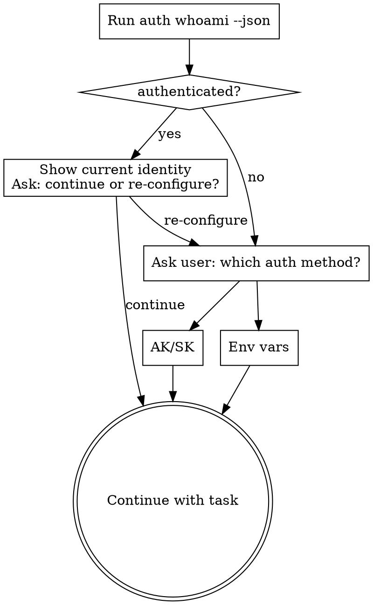

# Use MaxC CLI

Use the live CLI instead of inventing a separate MaxCompute adapter. Prefer `maxc ...`; fall back to `python3 -m maxc_cli ...` when the console script is not on `PATH`.

## When To Use

- First-time setup or repair of Python or `maxc-cli`
- Auth bootstrap or identity inspection (AK/SK or env vars)
- Migrating from odpscmd (reusing existing ODPS Console credentials)
- Session project or schema overrides
- Metadata discovery, schema inspection, cache-backed search
- Read-only query execution or job tracking
- Cache and semantic-metadata workflows

Do **not** use when the task is to implement `maxc-cli` itself, or when the user wants raw pyodps/SDK code.

## Bootstrap Flow

> **快速初始化**：参考 [bootstrap-ncs.sh](https://maxcompute-repo.oss-cn-hangzhou.aliyuncs.com/maxc-cli/bootstrap-ncs.sh) 脚本 step by step 初始化环境（安装 ncs → 安装 maxc-cli → 配置认证 → 安装 Agent Skill）。也可手动按以下流程操作。



**When already authenticated, always show the current identity and ask before continuing:**

> "Currently authenticated as `<principal_display>` on project `<project>` via `<auth_type>`.
> Continue with this, or re-configure auth?"

**When auth is not ready, always ask the user before choosing a path:**

> "Which auth method would you like to use?
> (A) Access Key / Secret Key — long-lived key pair
> (B) Environment variables — keys already set in the current shell
> (C) External credential provider — NCS or other command-based auth (common for internal users)"

Then follow the corresponding section in [references/bootstrap-auth.md](references/bootstrap-auth.md).

**For internal users with odpscmd already installed**, prefer the migration path:
> "Do you already have odpscmd configured? If so, we can migrate your existing auth."

See [references/migrate-from-odpscmd.md](references/migrate-from-odpscmd.md) for the field mapping. The key mapping: `account_provider=external` + `processCommand=ncs ...` → `provider: external` + `process_command: ncs ...`.

## First Pass

1. Prefer `maxc ...`; use `python3 -m maxc_cli ...` if not on `PATH`. If the machine may not be bootstrapped, read [references/setup-install.md](references/setup-install.md) first.
2. Run `maxc auth whoami --json`. Check `data.identity`:
   - `authenticated=true, validation_status=verified` → ready, continue.
   - `configured=false` → no auth set up → follow Bootstrap Flow above (or [references/bootstrap-auth.md](references/bootstrap-auth.md) for full details). If migrating from odpscmd, see [references/migrate-from-odpscmd.md](references/migrate-from-odpscmd.md).
   - `configured=true, validation_status=failed` → config exists but remote check failed → inspect warnings, then fix or re-login.
3. Read [references/command-patterns.md](references/command-patterns.md) for command syntax and output shapes.

## Working Rules

- All queries are client-side read-only (write operations are blocked before reaching MaxCompute). The `data.safety` block in query/job responses records the policy decision (`allowed` or `blocked`).
- Use `--force` only when write operations are explicitly authorized and required.
- Prefer `--json` for machine-driven work. Use `--format markdown` for user-facing output, or `--format brief` in token-constrained contexts.
- `--json` is shorthand for `--format json`; `--format` is a global flag (before the subcommand).
- `--json` stdout is one final envelope. Exception: `job wait --stream` emits NDJSON events.
- `cache build --json` emits progress to `stderr`, one final envelope to `stdout`.
- Trust runtime help and actual command output over stale snippets.
- Never install or upgrade Python without explicit user confirmation.
- Prefer `auth login` over hand-editing `~/.maxc/config.yaml`.
- If the user is already authenticated (`auth whoami` shows `authenticated=true`), never ask them to re-authenticate for permission errors. Permission issues are almost always caused by wrong project/workspace, not wrong credentials — see Dev vs Production Workspaces.
- `meta search` uses Catalog API (server-side FTS via pyodps RestClient) when auto-routed; falls back to cache-backed substring match, then live scan. No extra SDK dependency required.
- All meta and data commands support `--project` for per-call project override without switching session (e.g. `maxc meta list-tables --project other_project --json`).
- Most meta commands support `--schema` to override the session default (list-tables, search, search-columns).
- `session set/show/unset` are local-only — no authenticated backend required.
- `agent context` is a fast local config summary (auth status, backend reachability, capabilities, skill path); does not enumerate tables.
- `agent skill` returns the SKILL.md path and metadata.
- `agent install-skill <platform>` registers the skill with an Agent platform (claude-code, cursor, windsurf, codex, qwen, qoder, qoderwork). Idempotent; re-run after `pip install --upgrade` to update local skill files.
- Use normalized `data` shapes: `auth whoami` → `data.identity`, `query`/`job result` → `data.result`, `meta describe` → `data.table`, `data sample` → `data.sample`.
- Use `agent_hints.next_actions[]` for suggested follow-up commands. Each entry is a ready-to-run CLI command string. Do not execute them blindly — verify the command makes sense for your current context first.
- Before exploring an unfamiliar project, ask the user which schema/table they need — do not iterate all schemas.
- When a query fails with `SQL_ERROR`, read `error.suggestion` before retrying. Do not retry the same SQL unchanged.
- For partitioned tables, always determine the partition value via `meta latest-partition` or `meta partitions` before querying.
- When writing SQL for date-partitioned tables, use the exact partition format returned by `meta latest-partition` (format varies by table).

## Dev vs Production Workspaces

MaxCompute projects are organized into **dev** (development) and **production** workspaces. This is the most common source of permission errors.

### Key facts

- Dev workspaces have the `_dev` suffix (e.g. `my_project_dev`). Production workspaces have no suffix (e.g. `my_project`).
- The project configured in `~/.maxc/config.yaml` or env vars is always a **dev** workspace — this is the user's home workspace.
- Personal accounts usually only have access to the dev workspace. Accessing the production workspace directly will result in `PERMISSION_DENIED`.
- `--project` is used to access **another project's** tables (usually the production workspace or a different team's project).

### How to tell which workspace you are in

```bash
maxc auth whoami --json    # check data.identity.project — ends with _dev?
maxc session show --json   # check current session project
```

If the project name does NOT end with `_dev`, you may be pointed at a production workspace by mistake.

### Accessing production tables from dev workspace

Use `--project` to read metadata from the production workspace without switching session:

```bash
# Browse production tables
maxc meta list-tables --project my_project --json
maxc meta describe my_table --project my_project --json
maxc data sample my_table --project my_project --json
```

When writing SQL, use `project.table` format to reference tables in another workspace:

```sql
-- From dev workspace, query a production table
SELECT * FROM my_project.my_table WHERE ds = '20260418' LIMIT 100
```

Do NOT use bare table names (`FROM my_table`) when the target table lives in a different project — the query will fail with `TABLE_NOT_FOUND`.

### Common permission error scenarios

| Scenario | Symptom | Fix |
|----------|---------|-----|
| Config points to production workspace | `PERMISSION_DENIED` on most operations | `maxc session set --project my_project_dev` |
| Need to read production table metadata | `PERMISSION_DENIED` on `meta describe` | `maxc meta describe my_table --project my_project --json` |
| SQL references a table in another project without project prefix | `TABLE_NOT_FOUND` | Use `project.table` format in SQL |
| Mixed access: dev metadata + production data | Confusing results | Be explicit: use `--project` for metadata commands, `project.table` in SQL |

## Parsing JSON Output

All `--json` output follows the envelope format. Use `jq` or Python to extract fields. Always check `status` first — on `failure`, read `error.suggestion`; on `success`/`pending`, check `agent_hints.next_actions` and `agent_hints.warnings`.

Key paths: `data.result.rows` (query), `data.analysis` (cost/explain), `metadata.job_id` (async). See [references/json-output-format.md](references/json-output-format.md) for full examples.

## NL2SQL Workflow

Standard flow for answering data questions:

```
1. meta list-tables --schema <s> --json     → get table names + schema_name
2. meta describe <schema.table> --json      → get ALL columns (--json returns full schema)
3. query cost "SELECT ..." --json           → estimate cost (skip for simple queries)
4. query "SELECT ..." --json                → execute query
```

Add `--project <p>` to any step when working with a non-default project.

**Critical rules:**
- Always use schema-qualified table names in SQL: `<schema>.<table>` (e.g. `california_schools.frpm`), not bare table names. The `list-tables` output includes `schema_name` for each table.
- `meta describe --json` returns **all columns** automatically. Without `--json`, use `--full` to avoid truncation.
- Column names with spaces or special characters must be backtick-escaped: `` `column name` ``.
- When filtering by column values, first check actual values with `data sample` or a `SELECT DISTINCT` query — don't guess enum values.
- For partitioned tables, always filter by partition column in WHERE (e.g. `WHERE ds = '20260415'`) to avoid full-table scans. Use `maxc meta partitions <table>` to discover available partitions.
- When accessing tables from another project, use `project.table` format in SQL (see Dev vs Production Workspaces).
- Never log, echo, or include AK/SK in output — even in error context.

## Partition Query Strategy

Before querying a partitioned table, always determine the correct partition value:

```
1. maxc meta describe <table> --json  → check partition_columns
   - No partitions? → Query directly with LIMIT
   - Has partitions? → Continue to step 2

2. maxc meta latest-partition <table> --json  → get latest value and format
   - Note the exact format (e.g. "20260415" vs "2026-04-15")

3. Construct WHERE clause using exact value from step 2
   - Example: WHERE ds = '20260415' LIMIT 100

4. For "_df" tables: latest partition = latest full snapshot
   For "_di" tables: may need date range for complete picture
```

Prefer `meta latest-partition` over `MAX_PT()` for ad-hoc queries — MAX_PT may return incomplete partitions or only consider the first partition level.

See [references/partition-guide.md](references/partition-guide.md) for naming conventions, MAX_PT() guidance, and ambiguity handling.

## Query Commands

```bash
# Execute a query
maxc query "SELECT * FROM schema.table LIMIT 10" --json

# With SET options (parsed and passed as hints to MaxCompute)
maxc query "SET odps.sql.type.system.odps2=true; SELECT CAST(id AS INT) FROM schema.table LIMIT 10" --json

# Estimate cost before running
maxc query cost "SELECT * FROM schema.table" --json

# Explain execution plan
maxc query explain "SELECT * FROM schema.table" --json

# Submit and return immediately (async)
maxc query "SELECT ..." --wait 0 --json

# Auto-abort if cost exceeds threshold
maxc query "SELECT ..." --cost-check 10.0 --json
```

Note: the command is `query`, not `sql`. There is no `maxc sql` command.

## MaxCompute SQL Notes

Key dialect differences from MySQL/Hive/ANSI SQL:

1. **Type coercion** is project-level; some projects default to ODPS 1.0 (no implicit conversions). Use `SET odps.sql.type.system.odps2=true;` before your SQL to enable ODPS 2.0 types.
2. **String comparison** is case-sensitive by default. Use `TOLOWER()` / `TOUPPER()` for case-insensitive matching.
3. **`LIMIT` without `ORDER BY`** returns non-deterministic rows.
4. **`NULL = NULL`** evaluates to `NULL`, not `TRUE` — use `IS NULL`.

See [references/maxcompute-sql-notes.md](references/maxcompute-sql-notes.md) for the complete dialect reference including SET options, date functions, and common error codes.

## Common Mistakes

| Mistake | Correct approach |
|---------|-----------------|
| Using bare table names in SQL (`FROM frpm`) | Use schema-qualified names: `FROM california_schools.frpm` |
| Guessing column filter values (`WHERE type = 'Continuation'`) | Check actual values first: `data sample` or `SELECT DISTINCT` |
| Using `maxc sql ...` | The command is `maxc query ...` |
| Using `auth login --from-env` without checking env vars exist | Run `auth whoami --json` first; only use `--from-env` when env vars are confirmed set |
| Hand-editing `~/.maxc/config.yaml` | Use `auth login` |
| Inventing endpoints | Only use endpoints the user provided or that exist in current config |
| Using `job wait --stream` and expecting a JSON envelope | `--stream` emits NDJSON; use plain `job wait --json` for envelope |
| Running a query without checking cost first | Use `query cost` before large queries; use `--cost-check` to set auto-abort threshold |
| Ignoring `agent_hints.warnings` in the response | Always check warnings — they surface backend issues, cache staleness, and cost alerts |
| Assuming `meta describe` data is live | Cache source may be stale; check `metadata.source` field and `agent_hints.warnings` |
| Querying partitioned table without partition filter, or hardcoding/guessing partition values | Always run `meta latest-partition` first; use the exact returned value in WHERE (see Partition Query Strategy) |
| Using a production project name as default, or accessing another project's tables without `project.table` format | See Dev vs Production Workspaces |

## Agent Anti-Patterns

| Anti-pattern | Why it fails | Do this instead |
|-------------|-------------|-----------------|
| Iterating all schemas/tables to "discover" what's available | Slow, may hit rate limits, wastes tokens | Ask the user which project/schema/table they need |
| Retrying the exact same failed SQL without changes | Same input → same error | Read `error.suggestion`, fix the SQL, then retry |
| Using `SELECT *` on unknown tables | May scan TB of data, hit cost limits | Use `meta describe` first, then select only needed columns with LIMIT |
| Generating SQL without checking column names first | Column names are often non-obvious (Chinese, abbreviated) | Always `meta describe` before writing SQL |
| Running multiple queries when one suffices | Wastes compute and time | Combine into a single query with JOINs or subqueries |

## Error Recovery

When `status=failure`, check `error.code` and `error.suggestion`. Common codes: `TABLE_NOT_FOUND`, `PERMISSION_DENIED`, `SQL_ERROR`, `COST_LIMIT_EXCEEDED`. See [references/error-recovery.md](references/error-recovery.md) for the full error code table.

## Wait and Timeout Behavior

- `query "..." --wait N --json`: polls for up to N seconds. If the job finishes within N seconds, returns the result. If not, auto-promotes to async and returns `status=pending` with a `job_id`.
- `query "..." --wait 0 --json`: submits the job and returns immediately with `status=pending` and a `job_id`.
- `job wait <id> --timeout N --json`: waits up to N seconds for the job to complete. Returns `status=pending` if the timeout is reached.
- Default `--wait` for `query` is 10 seconds. Default `--timeout` for `job wait` is 300 seconds.
- For long-running queries, use `--wait 0` to get the job_id immediately, then poll with `job status`.

### Async Query Example

For queries that may take longer than the default 10s timeout, use this two-step pattern:

```bash
# Step 1: Submit and return immediately
maxc query "SELECT * FROM my_schema.big_table WHERE ds = '20260418'" --wait 0 --json
# Returns: { "status": "pending", "metadata": { "job_id": "<job_id>" } }

# Step 2: Wait for the result (use the actual job_id from step 1, not the placeholder)
maxc job wait <job_id> --json
# Returns the query result when complete, or status=pending if timeout reached
```

Typical agent flow:
1. Run `maxc query "..." --wait 0 --json` to submit
2. Extract `metadata.job_id` from the response (the actual ID, e.g. `2026042011_abc123`)
3. Run `maxc job wait <job_id> --json` substituting the real ID
4. If `status` is still `pending`, run `maxc job wait <job_id> --timeout 600 --json` with a longer timeout

## Multi-Project Workflow

All meta and data commands accept `--project` for one-off cross-project access without switching session:

```bash
# One-off: list tables in another project
maxc meta list-tables --project other_project --json

# One-off: describe a table in another project
maxc meta describe default.my_table --project other_project --json

# One-off: sample data from another project
maxc data sample my_table --project other_project --json
```

Use `session set --project` when you need to stay in that project for multiple commands:

```bash
# Switch session to a different project
maxc session set --project other_project --json

# Optionally set a specific schema
maxc session set --project other_project --schema my_schema --json

# Verify the switch
maxc session show --json

# Build cache for the new project
maxc cache build --json

# Revert to config defaults
maxc session unset --json
```

Session overrides are stored in `~/.maxc/session_override.yaml` and take priority over config files and env vars for project/schema only.

## Schema Operations

Some MaxCompute projects use **3-tier namespace** (`project.schema.table`); others use **2-tier** (`project.table` only). Detect at runtime: run `maxc meta list-schemas --json` — if it returns an error or empty result, the project is 2-tier and you should skip the schema layer entirely.

For 3-tier projects:

```bash
# List available schemas (in current or another project)
maxc meta list-schemas --json
maxc meta list-schemas --project other_project --json

# List tables in a specific schema (two approaches)
maxc meta list-tables --schema california_schools --json        # one-shot
maxc session set --schema california_schools --json             # sticky session

# Search within a schema
maxc meta search school --schema california_schools --json
maxc meta search-columns county --schema california_schools --json

# Build cache for a specific schema
maxc cache build --schema california_schools --json

# Describe a table (use schema.table_name format)
maxc meta describe california_schools.frpm --json

# Reset to default schema
maxc session unset --json
```

When `--schema` is given, it overrides `session set --schema`. When neither is set, the project default schema is used.

## Cache Mechanism

`cache build` stores table metadata locally for faster `list-tables`, `search`, `search-columns`, and `describe`. Falls back to live queries on cache miss.

Common commands:

```bash
maxc cache build --json                          # build for current project/schema
maxc cache build --schema my_schema --json       # build for a specific schema
maxc cache status --json                         # check cache freshness
maxc cache clear --json                          # wipe cache (forces full rebuild)
```

See [references/cache-mechanism.md](references/cache-mechanism.md) for cache key structure, miss behavior, and rebuild guidance.

## Known Limitations

| Feature | Status | Detail |
|---------|--------|--------|
| `meta search` | Catalog API preferred | Server-side FTS via pyodps RestClient (auto-routed, no extra deps); falls back to cache/live substring match |
| `list-tables` pagination | Not implemented | CLI-side `--cursor` is offset token, not server-side cursor |
| `diff data` | Snapshot compare | Keyed snapshot compare, not exhaustive diff |
| `auth login` | Plaintext YAML | AccessKey stored in `~/.maxc/config.yaml` (file permissions 0600) |
| Write operations | Client-side read-only | Write operations blocked by CLI before submission; `--force` bypasses |

## Capability Boundaries

| Boundary | Detail | Alternative |
|----------|--------|-------------|
| Read-only enforcement | Client-side SQL keyword detection; write operations blocked before reaching MaxCompute | Use odpscmd, pyodps SDK, or DataWorks |
| No permission management | `auth can-i` checks one table+operation; cannot enumerate accessible tables | MaxCompute console or project admin tools |
| No complete permission inventory | Cannot iterate projects to discover all readable tables | Ask user for target project/table |
| No data upload/import | Read-only tool | Use odpscmd tunnel or DataWorks |
| No lineage API | Returns `supported: false` placeholder | Use DataWorks lineage |
| No resource/UDF management | No upload/registration | Use odpscmd or DataWorks |

## Cost Control

Before running large queries, always estimate cost first:

```bash
# Check cost before executing
maxc query cost "SELECT * FROM big_table" --json

# Auto-abort if cost exceeds threshold (in CU)
maxc query "SELECT * FROM big_table" --cost-check 10.0 --json

# Use dry-run to see the plan without execution
maxc query "SELECT * FROM big_table" --dry-run --json
```

The `agent context` output includes `cost_threshold_cu` (project-level default) and `allowed_operations` — respect these guardrails.

## Semantic Metadata Workflow

Semantic metadata enriches tables with business context for NL2SQL. When `meta describe` warns about missing semantic metadata, generate it and save with `meta semantic set`. See [references/semantic-metadata.md](references/semantic-metadata.md) for usage.

## Diff Workflow

Compare tables across environments: `diff schema`, `diff partition`, `diff data`. See [references/diff-workflow.md](references/diff-workflow.md) for examples.

## Troubleshooting

| Symptom | Cause | Fix |
|---------|-------|-----|
| `list-tables` returns empty but tables exist | Wrong schema or no tables in default schema | Use `--schema <name>` or `session set --schema` |
| `search` returns no matches | Keyword not in table/column names or descriptions | Try broader keywords; check with `list-tables --schema` first |
| `cache build` reports 0 tables | Schema not specified for non-default schemas | Add `--schema <name>` |
| `describe` fails with NOT_FOUND | Table in a different schema | Use `schema.table_name` format or set session schema |
| Commands hang or timeout | Network/endpoint issue | Check `auth whoami --json` for endpoint; verify connectivity |

When all else fails, verify with raw pyodps:
```python
from odps import ODPS
o = ODPS(access_id, secret_key, project, endpoint)
list(o.list_tables(schema='<schema_name>'))
```

## Command Families

- Bootstrap: `python3 --version`, `pip install --upgrade maxc-cli`, `python3 -m maxc_cli --help`
- Auth and session: `auth whoami`, `auth login`, `auth can-i`, `session set/show/unset`
- Metadata and data: `meta list-tables`, `meta describe`, `meta search`, `meta search-columns`, `meta latest-partition`, `meta freshness`, `meta partitions`, `meta list-projects`, `meta list-schemas`, `data sample`, `data profile`
- Query and jobs: `query`, `query cost`, `query explain`, `job submit/status/wait/result/diagnose/cancel/list`
- Cache and semantic metadata: `cache build`, `cache build-status`, `cache status`, `cache clear`, `meta semantic set/get/list-missing`
- Diffs and context: `diff schema`, `diff partition`, `diff data`, `agent context`
- Agent and skill: `agent context`, `agent skill`, `agent install-skill`
