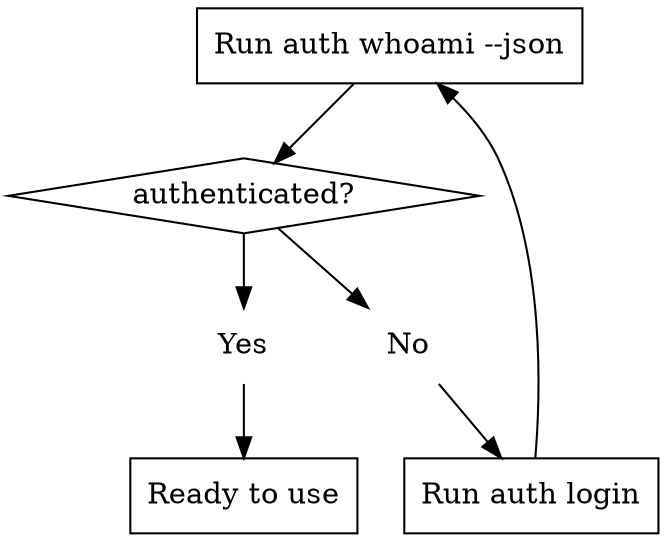

# Use MaxC CLI

Use the live CLI instead of inventing a separate MaxCompute adapter. Prefer `maxc ...`; fall back to `python3 -m maxc_cli ...` when the console script is not on `PATH`.

## When To Use

- First-time setup or repair of Python or `maxc-cli`
- Auth bootstrap or identity inspection (AK/SK or env vars)
- Session project or schema overrides
- Metadata discovery, schema inspection, cache-backed search
- Read-only query execution or job tracking
- Cache and semantic-metadata workflows

Do **not** use when the task is to implement `maxc-cli` itself, or when the user wants raw pyodps/SDK code.

## Bootstrap Flow



### Quick Check

```bash
maxc auth whoami --json
```

Interpret the `data.identity` fields:

| authenticated | configured | validation_status | Meaning |
|---|---|---|---|
| true | true | verified | Ready — proceed to commands |
| false | false | missing_configuration | No auth — run `maxc auth login` |
| false | true | failed | Config exists but invalid — re-login |

### Auth Login

```bash
# From environment variables (ALIBABA_CLOUD_ACCESS_KEY_ID, ALIBABA_CLOUD_ACCESS_KEY_SECRET)
maxc auth login --from-env --json

# Explicit AK/SK
maxc auth login --access-id "<id>" --secret-access-key "<secret>" --project "<project>" --endpoint "<endpoint>" --json

# NCS internal
maxc auth login-ncs --json
```

After login, verify:

```bash
maxc auth whoami --json
maxc session show --json
```

## Command Reference

### Environment Check

```bash
maxc agent context --json    # Version, auth status, backend reachability, skill path, full command list
maxc agent skill --json      # SKILL.md location and metadata
maxc agent commands --json   # Structured command catalog
```

### Query

```bash
maxc query run "SELECT * FROM my_table LIMIT 10" --json
maxc query cost "SELECT * FROM my_table" --json
maxc query explain "SELECT * FROM my_table" --json
# Shorthand: "run" is default
maxc query "SELECT * FROM my_table LIMIT 10" --json
```

### Jobs (Async)

```bash
maxc job submit "SELECT * FROM large_table" --json
maxc job status <job_id> --json
maxc job wait <job_id> --timeout 600 --json
maxc job result <job_id> --max-rows 200 --json
maxc job list --json
maxc job diagnose <job_id> --json
maxc job cancel <job_id> --json
```

### Metadata

```bash
maxc meta list-tables --json
maxc meta list-projects --json
maxc meta list-schemas --json
maxc meta describe <table_name> --json
maxc meta search "<keyword>" --json
maxc meta search-columns "<keyword>" --json
maxc meta partitions <table_name> --json
maxc meta latest-partition <table_name> --json
maxc meta freshness <table_name> --json
maxc meta lineage <table_name> --json     # Returns supported=false if backend unavailable
```

### Data

```bash
maxc data sample <table_name> --rows 20 --json
maxc data sample <table_name> --partition "ds=20260101" --columns col1,col2 --json
maxc data profile <table_name> --json
maxc data profile <table_name> --partition "ds=20260101" --json
```

### Diff

```bash
maxc diff schema <left_table> <right_table> --json
maxc diff partition <left_table> <right_table> --json
maxc diff data <left_table> <right_table> --key-columns id --json
```

### Cache & Semantic

```bash
maxc cache build --json
maxc cache build-status --json
maxc cache status --json
maxc cache clear --json
maxc cache save-semantic <table_name> --business-terms "orders, revenue" --json
maxc cache get-semantic <table_name> --json
```

## Output Format

All commands support `--json` for structured output using Envelope v2.0:

```json
{
  "command": "query.run",
  "status": "success",
  "data": { ... },
  "metadata": { ... },
  "error": null,
  "agent_hints": {
    "next_actions": ["maxc meta describe <table>"],
    "warnings": [],
    "insights": []
  },
  "version": "2.0"
}
```

On error:

```json
{
  "command": "query.run",
  "status": "failure",
  "data": {},
  "metadata": {},
  "error": {
    "code": "AUTH_EXPIRED",
    "message": "ODPS access token expired",
    "suggestion": "Re-authenticate and retry",
    "recoverable": true,
    "recovery_steps": [
      "maxc auth login --from-env --json",
      "maxc auth whoami --json",
      "Retry the original command"
    ]
  },
  "agent_hints": null,
  "version": "2.0"
}
```

## Common Error Recovery

| Error Code | Meaning | Recovery |
|---|---|---|
| AUTH_EXPIRED | Token expired | `maxc auth login --from-env --json` then retry |
| AUTH_MISSING | No credentials | `maxc auth login` with AK/SK or `--from-env` |
| PERMISSION_DENIED | No access to table/project | Check with `maxc auth can-i --table <t> --operation SELECT --json` |
| VALIDATION_ERROR | Invalid input (bad SQL, etc.) | Fix the input per `error.suggestion` |
| JOB_TIMEOUT | Job exceeded time limit | Retry with `--timeout` or optimize query |
| BACKEND_UNREACHABLE | Cannot connect to ODPS | Check network, endpoint, credentials |

## Detailed References

- [Bootstrap & Auth](references/bootstrap-auth.md)
- [Command Patterns](references/command-patterns.md)
- [Setup & Install](references/setup-install.md)
